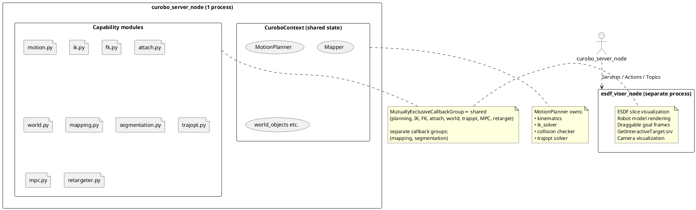

# Isaac ROS cuMotion

> **Fork notice:** This repository is a fork of NVIDIA's `isaac_ros_cumotion`
> and related packages, forked because NVIDIA did not ship a ROS-ready version
> of cuRobo v2. It retains NVIDIA's original licensing terms (see `LICENSE`
> files in each submodule). The code merged here is built on top of NVIDIA's
> cuRobo library and Isaac ROS framework — respect the original copyrights and
> license obligations when distributing or modifying.

NVIDIA cuRobo v2 wrapped as a single GPU-accelerated ROS 2 node for arm motion
planning, IK/FK, collision checking, world management, depth-to-ESDF mapping,
robot segmentation, trajectory optimization, and model-predictive control.

## ROS Nodes

| Node | Executable | Package | Purpose |
|---|---|---|---|
| `curobo_server` | `curobo_server_node` | `isaac_ros_cumotion` | **The one node.** Loads `MotionPlanner` once in `__init__` (which owns kinematics, IK solver, collision checker, trajopt solver). Every capability — planning, grasping, IK, FK, collision checking, world updates, attach/detach, mapping, segmentation, trajectory optimization, MPC, motion retargeting — runs in this process and shares the same GPU model. |
| `esdf_viser_node` | `esdf_viser_node` | `isaac_ros_esdf_visualizer` | **Separate visualizer.** Renders ESDF slices, robot model, camera frustums, and draggable goal frames in a Viser web UI (`http://localhost:8080`). Does not construct any cuRobo GPU model — purely a viewer. |
| `pose_to_pose_node` | `pose_to_pose_node` | `isaac_ros_moveit_goal_setter` | MoveIt 2 integration: converts MoveIt motion planning requests into calls to the unified node's action/service interfaces. |
| `goal_initializer_node` | `goal_initializer_node` | `isaac_ros_moveit_goal_setter` | MoveIt 2 integration: provides goal initialization GUI and goal validation for MoveIt's planning pipeline. |
| `builder` | `builder` | `isaac_ros_cumotion_robot_description` | Offline CLI tool. Generates cuRobo robot configs (collision spheres, self-collision matrix) from URDF+XACRO. See [Creating a Robot Description](#creating-a-robot-description). |

ROS example scripts (one per capability) live in the `isaac_ros_cumotion` package
as `ros_example_motion_planning`, `ros_example_inverse_kinematics`, etc.
Run them with `ros2 run isaac_ros_cumotion <example_name>`.

## Launch

### Main server + Viser viewer

```bash
# Terminal 1: cuRobo server
ros2 launch isaac_ros_cumotion isaac_ros_cumotion.launch.py

# Terminal 2: 3D visualizer (Viser, http://localhost:8080)
ros2 launch isaac_ros_esdf_visualizer esdf_viser.launch.py params_file:=/path/to/params.yaml
```

The server reads parameters from `isaac_ros_cumotion/params/isaac_ros_cumotion_params.yaml`.
Override with `ros2 run`:

```bash
ros2 run isaac_ros_cumotion curobo_server_node \
  --ros-args -p robot:=gen3 \
  -p urdf_path:=/path/to/robot.urdf \
  -p yml_file_path:=/path/to/robot.yml
```

### Key parameters

| Parameter | Default | Description |
|---|---|---|
| `robot` | `""` | Robot name used to find config |
| `urdf_path` | `""` | Path to URDF file |
| `yml_file_path` | `""` | Path to cuRobo `.yml` config |
| `tool_frame` | `""` | Default end-effector frame |
| `joint_states_topic` | `/joint_states` | Robot joint state topic |
| `time_dilation_factor` | `0.5` | Velocity/acceleration scaling (1.0 = nominal) |
| `interpolation_dt` | `0.025` | Trajectory interpolation time step (s) |
| `max_attempts` | `10` | Maximum planning attempts |
| `num_trajopt_seeds` | `6` | Trajectory optimization seeds |
| `num_graph_seeds` | `6` | Graph planner seeds (fallback) |
| `enable_cuda_mps` | `False` | Enable CUDA MPS for GPU sharing |
| `esdf_service_name` | `/nvblox_node/get_esdf_and_gradient` | ESDF service topic |
| `grid_size_m` | `[2.0, 2.0, 2.0]` | ESDF grid size in meters |
| `esdf_voxel_size` | `0.05` | ESDF voxel resolution (m) |

## Key Concepts

### Configuration space (cspace / C-space)

The **configuration space** of a robot with N joints is the N-dimensional space
whose axes are joint positions. A point in cspace is a full set of joint angles
that uniquely determines the robot's pose. cuRobo plans trajectories in cspace,
which guarantees smooth motion because every intermediate configuration is a
valid, reachable state of the robot.

In practice: you send goal poses (Cartesian) or goal joint states, cuRobo solves
IK internally and plans a collision-free cspace trajectory.

### ESDF (Euclidean Signed Distance Field)

A voxel grid where each cell stores the **signed distance** to the nearest
obstacle surface: positive means free space, zero means surface, negative means
inside an obstacle. cuRobo's collision checker uses the ESDF to efficiently
query world-obstacle distances at any point in the robot's body, enabling
sub-centimeter collision awareness for planning and IK.

ESDF is populated from depth cameras via `Mapper` (nvblox-based 3D
reconstruction), which is built in `curobo_server_node` when depth topics are
configured.

### IK (Inverse Kinematics) vs FK (Forward Kinematics)

- **FK**: Given joint angles, compute the Cartesian pose of any link.
  - Service: `ComputeFK.srv`
- **IK**: Given a desired Cartesian pose, find joint angles that achieve it.
  - Service: `ComputeIK.srv`
  - cuRobo's IK is GPU-batched: you send N goal poses, it solves all N in
    parallel. Collision-awareness is always enabled (the shared `MotionPlanner`
    has a scene model). World obstacles added via `UpdateWorld` are live.

### World model

The world is the set of obstacles the robot must avoid. It is managed through
`UpdateWorld.srv` (add/replace/remove/collision objects) and `GetEsdf.srv`
(ESDF grid query). Internally, obstacles are stored in a `Dict[str, CollisionObject]`
and pushed to the GPU model as a unified scene on every change.

### Motion planner

cuRobo's `MotionPlanner` uses trajectory optimization (trajopt) as the primary
solver, with a graph-based planner as fallback. It produces smooth,
time-optimal, collision-free joint trajectories.

- `PlanMotion.action`: Cartesian or joint-space goal, returns joint trajectory.
- `PlanGrasp.action`: approach → grasp → lift chained in one call.

## Workflow: Plan, Smooth, Execute

### 1. Configure the world

Add obstacles so the planner knows what to avoid:

```bash
# Add a box obstacle
ros2 service call /cumotion/update_world isaac_ros_cumotion_interfaces/srv/UpdateWorld \
  '{operation: 0, objects: [{
    id: "table",
    primitives: [{type: 1, dimensions: [1.0, 0.8, 0.05]}],
    primitive_poses: [{position: {x: 0.5, y: 0.0, z: -0.4}}]
  }]}'
```

Clear with `operation: 3` (CLEAR_ALL).

### 2. Plan a motion

```bash
# Cartesian goal
ros2 action send_goal /cumotion/plan_motion isaac_ros_cumotion_interfaces/action/PlanMotion \
  '{goal_poses: [{position: {x: 0.4, y: 0.0, z: 0.3}, orientation: {w: 1.0}}]}'

# Joint-space goal
ros2 action send_goal /cumotion/plan_motion isaac_ros_cumotion_interfaces/action/PlanMotion \
  '{goal_joint_state: {name: ["joint1","joint2","joint3","joint4","joint5","joint6","joint7"],
    position: [0.0, -1.0, 0.0, 2.5, 0.0, 1.0, 0.0]}}'
```

The response contains `trajectory` (a `JointTrajectory` with positions,
velocities, accelerations, and time-from-start for each waypoint), plus
`success`, `message`, and `planning_time_s`.

### 3. Plan a grasp (approach → grasp → lift)

```bash
ros2 action send_goal /cumotion/plan_grasp isaac_ros_cumotion_interfaces/action/PlanGrasp \
  '{grasp_poses: [{position: {x: 0.5, y: 0.0, z: 0.1}, orientation: {w: 1.0, x: 0, y: 0.707, z: 0}}],
    grasp_approach_offset: 0.1, grasp_lift_offset: 0.15}'
```

Returns `approach_trajectory`, `grasp_trajectory`, `lift_trajectory` — three
segments you can execute sequentially.

### 4. (Optional) Trajectory optimization (smoothing)

If you have a trajectory and want to refine it against the current world:

```bash
ros2 action send_goal /cumotion/optimize_trajectory isaac_ros_cumotion_interfaces/action/OptimizeTrajectory \
  '{start_state: {position: [0.0, ...]}, goal_poses: [{position: {...}, orientation: {...}}]}'
```

This bypasses the full motion planner and runs `TrajOptSolver` directly for
trajectory refinement — useful when you have a seed trajectory and only need
local optimization.

### 5. Execute

Send the joint trajectory to your robot's trajectory controller:

```bash
ros2 topic pub /follow_joint_trajectory/goal trajectory_msgs/action/FollowJointTrajectory_Goal \
  '{trajectory: <trajectory from plan_motion>}'
```

The exact topic depends on your robot driver (e.g., `kortex_driver` for Kinova,
`franka_control` for Franka, `ur_robot_driver` for Universal Robots).

### 6. (Advanced) Model-predictive control

For real-time closed-loop tracking:

```bash
# Start MPC (action stays open until stopped)
ros2 action send_goal /cumotion/mpc/control isaac_ros_cumotion_interfaces/action/ControlMPC \
  '{goal_poses: [{position: {x: 0.4, y: 0.0, z: 0.3}, orientation: {w: 1.0}}]}'

# Update the goal mid-stream
ros2 service call /cumotion/mpc/update_goal isaac_ros_cumotion_interfaces/srv/UpdateMPCGoal \
  '{goal_poses: [{position: {x: 0.5, y: 0.0, z: 0.3}, orientation: {w: 1.0}}]}'

# Stop and get final tracking stats
ros2 service call /cumotion/mpc/stop isaac_ros_cumotion_interfaces/srv/StopMPC
```

MPC publishes commanded joint states on `/cumotion/mpc/commanded_joint_state` at
the control rate.

## Interfaces

### Actions (`isaac_ros_cumotion_interfaces`)

| Action | Endpoint | Purpose |
|---|---|---|
| `PlanMotion` | `/cumotion/plan_motion` | Collision-aware motion planning (Cartesian or joint-space goal) |
| `PlanGrasp` | `/cumotion/plan_grasp` | Approach → grasp → lift in one call |
| `AttachObject` | `/cumotion/attach_object` | Attach/detach objects to robot kinematics + collision model |
| `OptimizeTrajectory` | `/cumotion/optimize_trajectory` | Standalone trajectory optimization with `TrajOptSolver` |
| `ControlMPC` | `/cumotion/mpc/control` | Model-predictive control (action stays open until `StopMPC`) |
| `RetargetMotion` | `/cumotion/retarget_motion` | Batch motion retargeting via `MotionRetargeter.solve_sequence()` |

### Services

| Service | Endpoint | Purpose |
|---|---|---|
| `ComputeIK` | `/cumotion/compute_ik` | GPU-batched inverse kinematics (collision-aware) |
| `ComputeFK` | `/cumotion/compute_fk` | Forward kinematics |
| `CheckCollision` | `/cumotion/check_collision` | Read-only self/world collision check (no planning) |
| `UpdateWorld` | `/cumotion/update_world` | Add/replace/remove obstacles in the world model |
| `GetEsdf` | `/cumotion/update_esdf` | Read the ESDF grid for visualization or external use |
| `PublishStaticPlanningScene` | `/cumotion/publish_static_scene` | Publish the static planning scene as a MoveIt PlanningScene msg |
| `UpdateMPCGoal` | `/cumotion/mpc/update_goal` | Update MPC target while a `ControlMPC` action is running |
| `StopMPC` | `/cumotion/mpc/stop` | Stop an active MPC run and return tracking statistics |
| `GetInteractiveTarget` | `/cumotion/get_interactive_target` | **(Served by `esdf_viser_node`)** Read current pose of draggable Viser goal frames |

### Why `GetInteractiveTarget` exists

The Viser viewer (`http://localhost:8080`) renders the robot, world, and
interactive **control frames** — draggable 3D gizmo handles that you can grab
with the mouse and position anywhere in the scene. `GetInteractiveTarget.srv`
lets external code read back those manipulated poses. Typical use case:

1. User drags a goal frame to a desired position in the Viser UI
2. A planning node or script calls `GetInteractiveTarget` to fetch the pose
3. The pose is fed into `PlanMotion` or `ComputeIK` to generate a trajectory

This separates interactive visualization (the Viser viewer process) from
planning (the unified server) while still allowing data flow between them.

## Creating a Robot Description

cuRobo needs a `.yml` configuration file derived from your robot's URDF that
includes collision spheres (replacing the mesh for fast GPU collision checking)
and a self-collision distance matrix. The `builder` CLI in
`isaac_ros_cumotion_robot_description` generates this.

### From URDF

```bash
# Generate collision spheres and self-collision matrix from a URDF
ros2 run isaac_ros_cumotion_robot_description builder \
  --urdf /path/to/robot.urdf \
  --output robot.yml \
  --tool-frames tool0 \
  --compute-metrics \
  --visualize
```

### From XACRO (Kinova Gen3 example)

```bash
# 1. Resolve xacro to URDF
xacro $(ros2 pkg prefix iki_kortex_description)/share/iki_kortex_description/urdf_xacro/kortex_standalone.urdf.xacro \
  name:=gen3 arm:=gen3 dof:=7 gripper:=robotiq_2f_140 sim_gazebo:=true \
  > /tmp/kortex.urdf

# 2. Build cuRobo config with tool frames
ros2 run isaac_ros_cumotion_robot_description builder \
  --urdf /tmp/kortex.urdf \
  --output kortex_curobo.yml \
  --tool-frames grasping_frame \
  --compute-metrics \
  --visualize
```

### Refining an existing config

```bash
ros2 run isaac_ros_cumotion_robot_description builder \
  --edit-config robot.yml \
  --output robot_refined.yml \
  --refit-link gripper_link \
  --recompute-collisions \
  --sphere-density 2.0
```

### Key builder arguments

| Argument | Description |
|---|---|
| `--urdf` | Path to URDF file |
| `--edit-config` | Existing .yml to refine (mutually exclusive with `--urdf`) |
| `--output` | Output `.yml` or `.xrdf` path |
| `--tool-frames` | Names of end-effector link(s), space-separated |
| `--sphere-density` | Sphere fitting density (default: 1.0; higher = more spheres = tighter fit but slower) |
| `--compute-metrics` | Print per-link sphere coverage metrics |
| `--visualize` | Open Viser viewer to inspect the sphere model |
| `--no-prune` | Skip self-collision pruning |
| `--num-collision-samples N` | Configurations sampled to build the self-collision matrix (default: 1000) |

The output `.yml` file is what you pass as `yml_file_path` in the server
parameters. It is also named the **XRDF** (cuRobo Robot Description Format)
when exported with `--export-xrdf` — it bundles the URDF path, kinematics
parameters, collision spheres, self-collision matrix, and tool-frame definitions
into one file.

## ROS Example Scripts

The `isaac_ros_cumotion` package ships runnable ROS 2 examples:

```bash
ros2 run isaac_ros_cumotion ros_example_forward_kinematics
ros2 run isaac_ros_cumotion ros_example_inverse_kinematics
ros2 run isaac_ros_cumotion ros_example_collision_checking
ros2 run isaac_ros_cumotion ros_example_motion_planning
ros2 run isaac_ros_cumotion ros_example_grasp_planning
```

Each example connects to the running `curobo_server_node`, calls the relevant
action/service, and prints results.

## Architecture



The single `MotionPlanner` is constructed once in the server's `__init__` and
never duplicated. All capability handlers share the same GPU model through the
`CuroboContext` dataclass. Thread safety: all planner-touching callbacks use a
shared `MutuallyExclusiveCallbackGroup`. Mapping and segmentation run in their
own callback groups (they only write to `self.mapper`'s occupancy grid, not to
the planner).
